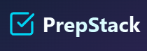
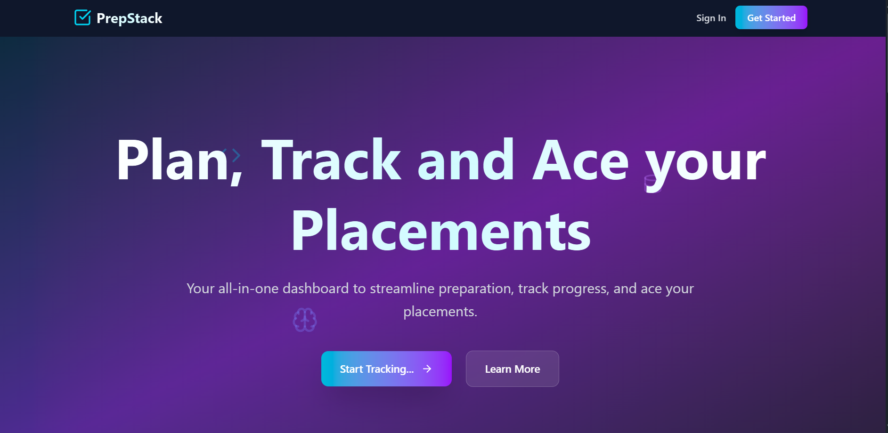

  
   
  <h1 align="center">PrepStack - Personal Placement Tracker</h1>
  

    An all-in-one dashboard to help students streamline preparation, track progress, and ace their placements.
     
     
    <a href="https://prep-stack-eta.vercel.app/" target="_blank"><strong>View Live »</strong></a>
  

---

### About The Project

Every student preparing for campus placements has faced the chaos: scattered notes, dozens of browser tabs for different resources, and the constant anxiety of not having a structured study plan. It's easy to feel overwhelmed and lose track of your progress.

**PrepStack** was built to solve this exact problem.

It's a full-stack MERN application that serves as a single source of truth for your entire preparation journey. Instead of jumping between different platforms, PrepStack provides a centralized and modern dashboard to manage everything, transforming a disorganized process into a clear, actionable plan. The goal is to empower students with the tools they need to stay consistent, organized, and confident.

---

### ✨ Key Features

* **📈 Dynamic Dashboard:** A central hub featuring a daily study streak tracker, an interactive activity calendar, and a bar chart to visualize study habits by subject.
* **✍️ Daily Study Logs:** Full CRUD (Create, Read, Update, Delete) functionality for logging daily study sessions.
* **🎯 Subject Goal Management:** Set and track progress against topic targets and save important resources for each subject.
* **📋 Company-Specific Checklists:** Create and manage dynamic checklists for different companies to track progress through interview rounds.
* **✅ Interactive DSA Tracker:** A dedicated page for "Love Babbar's 450 DSA Sheet," with a searchable UI and progress tracking via `localStorage`.
* **🔐 Secure User Authentication:** Complete registration and login system using JSON Web Tokens (JWT) for secure, persistent sessions.

---

### 🧰 Built With

| Technology         | Description                               |
| ------------------ | ----------------------------------------- |
| **Frontend** | React, React Router, Tailwind CSS, DaisyUI|
| **Backend** | Node.js, Express.js                       |
| **Database** | MongoDB with Mongoose                     |
| **Authentication** | JSON Web Tokens (JWT), bcryptjs           |
| **Deployment** | Vercel (Frontend), Render (Backend)       |

---

  

